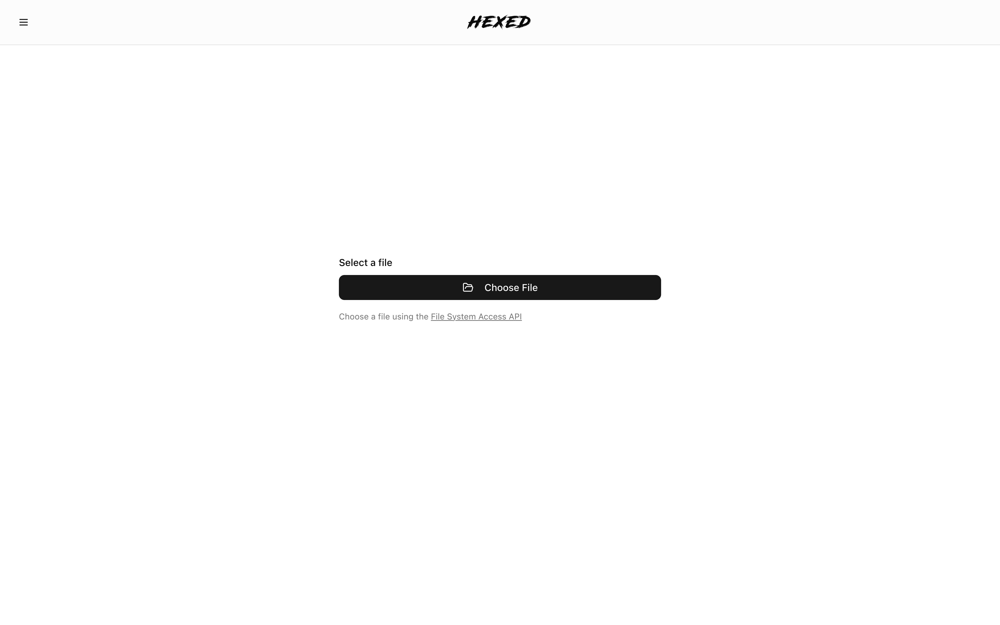
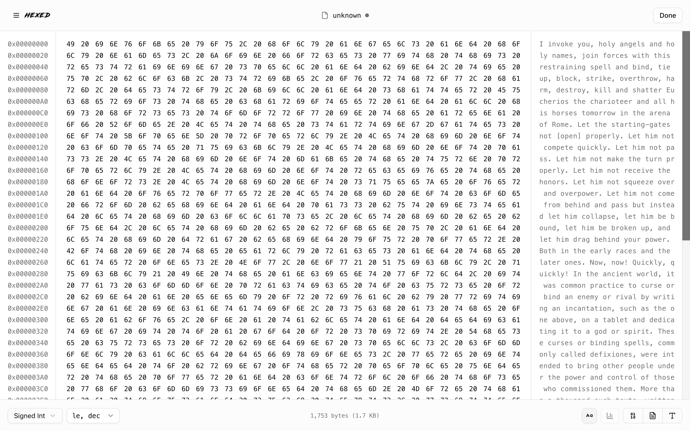

<center>
<picture >
  <!-- Source for dark mode -->
  <source media="(prefers-color-scheme: dark)" srcset="./screenshots/logo-dark.webp">
  <!-- Source for light mode (used as default/fallback) -->
  
</picture>


A modern hex editor for inspecting and tracking binary file changes in real-time.

Hexed provides a powerful interface for viewing binary files, tracking changes as they happen, and comparing different versions with visual diff tools. Perfect for developers, reverse engineers, and anyone working with binary data.

</center>

## Features

- **Real-time File Watching**: Automatically detects and displays changes to binary files
- **Hex Editor View**: Clean hex display with parallel ASCII view
- **Change Tracking**: Snapshots every change with tabs (Baseline, Change 1, Change 2, etc.)
- **Diff Visualization**: Inline and side-by-side comparison modes
- **Modern UI**: Built with shadcn/ui and Tailwind CSS v4
- **Desktop App**: Electron wrapper for native desktop experience
- **Interpreter**: View binary data as different types (signed/unsigned int, float, etc.)
- **Checksum Visibility**: MD5 checksums for file integrity verification
- **Keyboard Navigation**: Efficient keyboard shortcuts for navigation
- **Efficient Rendering**: Canvas-based rendering for smooth performance with large files

## Screenshots

**Homepage**
<picture>

  <source media="(prefers-color-scheme: dark)" srcset="./screenshots/home-dark.png">
  
</picture>

**Editor**
<picture>

  <source media="(prefers-color-scheme: dark)" srcset="./screenshots/editor-dark.png">
  
</picture>

## Tech Stack

- **Framework**: Next.js 15 with React 19
- **UI**: shadcn/ui + Tailwind CSS v4
- **Monorepo**: pnpm workspaces
- **Real-time**: Server-Sent Events (SSE)
- **File Watching**: chokidar
- **Desktop**: Electron
- **TypeScript**: Fully typed
- **Rendering**: Canvas-based hex editor for efficient rendering of large files

## Getting Started

### Prerequisites

- Node.js >= 18.0.0
- pnpm >= 8.0.0

### Installation

```bash
# Install dependencies
pnpm install
```

### Running the Web App

```bash
# Start development server
pnpm dev
```

The app will be available at `http://localhost:3000`

### Running the Desktop App

1. Start the web app in one terminal:

   ```bash
   pnpm dev
   ```

2. In another terminal, start the Electron app:
   ```bash
   pnpm dev:desktop
   ```

### Usage

1. Open the app in your browser (or use the desktop app)
2. Enter the full path to a binary file on your server's filesystem
3. Click "Open File" to start watching
4. The file will be displayed in hex editor view
5. Any changes to the file will automatically create new snapshot tabs
6. Use the diff toggle to compare changes between snapshots

## Developing

### Development Commands

```bash
# Run web development server
pnpm dev

# Run desktop app in development
pnpm dev:desktop

# Build web app for production
pnpm build

# Build desktop app
pnpm build:desktop

# Start production server
pnpm start

# Type check all packages
pnpm typecheck

# Clean all node_modules
pnpm clean:workspace
```

### Project Structure

```
hexed/
├── apps/
│   ├── web/              # Next.js web application
│   │   ├── app/
│   │   │   ├── api/      # API routes (SSE endpoints)
│   │   │   ├── components/  # UI components
│   │   │   └── hooks/    # React hooks
│   │   └── package.json
│   └── desktop/          # Electron desktop app
│       └── src/
└── packages/
    ├── binary-utils/     # Binary parsing, diffing, formatting
    ├── canvas/           # Hex canvas rendering
    ├── types/            # Shared TypeScript types
    └── ui/               # Shared UI components (shadcn)
```

## Contributing

We welcome contributions! Please see [CONTRIBUTING.md](CONTRIBUTING.md) for details.

### Quick Start for Contributors

1. Fork and clone the repository
2. Install dependencies: `pnpm install`
3. Start dev server: `pnpm dev`
4. Make your changes
5. Submit a pull request

### Areas for Contribution

- Add comprehensive tests
- Performance optimization for large files
- Persistent storage implementation
- Search/find functionality
- Byte editing capability
- Accessibility improvements

See [CONTRIBUTING.md](CONTRIBUTING.md) for more details on code style, commit guidelines, and the pull request process.

## FAQ

### How does real-time file watching work?

Hexed uses Server-Sent Events (SSE) to stream file changes from the server to the client. The server watches files using chokidar and sends snapshots whenever changes are detected.

### What file sizes are supported?

Hexed can handle files of various sizes. The hex editor uses efficient canvas-based rendering that only draws the visible viewport, ensuring smooth performance even with very large binary files.

### Can I edit files?

Currently, Hexed is read-only. File editing is planned for future releases.

### How do snapshots work?

Each time a file changes, Hexed creates a snapshot with a timestamp and MD5 checksum. Snapshots are stored in tabs (Baseline, Change 1, Change 2, etc.) and can be compared using the diff visualization tools.

### What storage backends are supported?

Currently, Hexed uses in-memory storage. The architecture supports an adapter pattern, making it easy to add persistent storage backends like IndexedDB, filesystem, or databases in the future.

### Can I use this with remote files?

Hexed currently watches files on the server's filesystem. The file path must be accessible to the Next.js server running the application.

### How does the desktop app differ from the web version?

The desktop app is an Electron wrapper around the web application. It provides a native window experience with features like a frameless window (macOS), draggable toolbar, and native file picker integration.

## License

ISC
